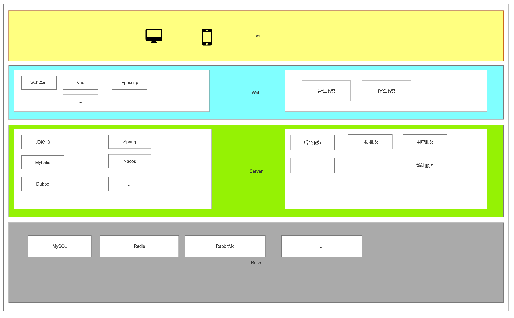

# 描述

问卷系统类似考试试系统，仿照考试系统来开发。分为题型管理，试题管理，考试管理，用户管理等等。


# 管理说明

## 题型管理

### 单选题

* 只能选择选项中的一个选项
* 可设置是否需要其他选项
  * 若有其他选项，也可指明是否需要补充其他说明

### 多选题

* 可以选择多个选项
* 可设置是否需要其他选项
  * 若有其他选项，也可指明是否需要补充其他说明

### 填空题

* 以一段文字描述，中间穿插需要补充的空白区
* 通过特殊的分割符(以下划线显示)定义空白区
  * 需要指定空白区长度，可以在标准输入中前后增加2-5个字符

### 判断题

* 只有对与错的选项
* 可以是输入型(√/×)，或者单选题类型

### 问答题

* 根据问题，做问题解答

### 连线题

* 根据选择项内容做内容匹配

### 画图题

* 根据问题，绘画

### 作文题

* 类似问答题，根据问题描述，自行总结内容，并书写指定长度的自我理解


## 试题管理

分为题库管理和试卷管理

### 题库管理

1. 设计明确的题内容，指定问题描述、题型、选项，作答等等。

2. 可以对单个试题做添加，删除、修改等操作
   1. 不可变更试题类型
   2. 不可在试题有试卷绑定时删除
   3. 不可真删除
3. 部分试题需要明确试题答案

### 试卷管理

1. 将多个试题绑定为一套试卷
2. 指定试题顺序，题号，分数
3. 指定是否需要答题号，一般分为大题号和小题号
4. 统计或校验试卷总分或其他限制条件
5. 除试题及顺序外，其他都为可选项


## 考试管理

1. 定义考试时间、时长、试卷、主/副监考人
2. 除试卷外，其他内容都是可选项


## 用户管理

* 限定考试用户范围：学校限定年级班级，社会无限制(可见即可答)
* 获取用户信息：根据推广方式获取所需信息


# 数据库设计

* 题型分类：名称，标识，描述，
* 试题库：问题，题型，描述，选项，答案
* 试卷信息：描述，分数，标题，
* 试卷详情：题号，试题，分数
* 作答信息：试卷，题号，解答

## 题库表`tb_questions`

<table>
	<tr>
        <th>字段</th>
        <th>类型</th>
        <th>长度</th>
        <th>说明</th>
    </tr>
    <tr>
        <td>id</td>
        <td>char(14)</td>
        <td>14</td>
        <td>题标识ID，生成规则：YYYYMMDDHHmmss</td>
    </tr>
    <tr>
        <td>title</td>
        <td>varchar(200)</td>
        <td>200</td>
        <td>问题</td>
    </tr>
    <tr>
        <td>type</td>
        <td>int(1)</td>
        <td>1</td>
        <td>题型分类，见题型表</td>
    </tr>
    <tr>
        <td>desc</td>
        <td>varchar(200)</td>
        <td>200</td>
        <td>问题描述</td>
    </tr>
    <tr>
        <td>cate</td>
        <td>varchar(100)</td>
        <td>100</td>
        <td>问题类别，见题类别表，逗号分割,待优化列</td>
    </tr>
</table>

<table>
	<tr>
        <th>索引分类</th>
        <th>索引名称</th>
        <th>索引类型</th>
        <th>索引列</th>
        <th>说明</th>
    </tr>
    <tr>
        <td>主键</td>
        <td>-</td>
        <td>唯一索引</td>
        <td>`id`</td>
        <td>题标识ID，生成规则：YYYYMMDDHHmmss</td>
    </tr>
    <tr>
        <td>索引</td>
        <td>idx_t</td>
        <td>普通索引</td>
        <td>`title`</td>
        <td>问题索引</td>
    </tr>
</table>


## 试题详情`tb_question_info`

<table>
	<tr>
        <th>字段</th>
        <th>类型</th>
        <th>长度</th>
        <th>说明</th>
    </tr>
    <tr>
        <td>qid</td>
        <td>char(14)</td>
        <td>14</td>
        <td>题标识ID，见题库表</td>
    </tr>
    <tr>
        <td>content</td>
        <td>blob</td>
        <td>-</td>
        <td>选项或描述，根据题型补充</td>
    </tr>
    <tr>
        <td>anwser</td>
        <td>blob</td>
        <td>-</td>
        <td>选项或问答内容</td>
    </tr>
</table>


<table>
	<tr>
        <th>索引分类</th>
        <th>索引名称</th>
        <th>索引类型</th>
        <th>索引列</th>
        <th>说明</th>
    </tr>
    <tr>
        <td>主键</td>
        <td>-</td>
        <td>唯一索引</td>
        <td>`qid`</td>
        <td>题标识ID</td>
    </tr>
</table>

## 分类表`tb_cate`

<table>
	<tr>
        <th>字段</th>
        <th>类型</th>
        <th>长度</th>
        <th>说明</th>
    </tr>
    <tr>
        <td>id</td>
        <td>int(11)</td>
        <td>11</td>
        <td>标签ID</td>
    </tr>
    <tr>
        <td>name</td>
        <td>varchar(50)</td>
        <td>50</td>
        <td>分类名称</td>
    </tr>
    <tr>
        <td>pid</td>
        <td>int(11)</td>
        <td>11</td>
        <td>父类分类ID</td>
    </tr>
    <tr>
        <td>order</td>
        <td>int(11)</td>
        <td>11</td>
        <td>顺序</td>
    </tr>
</table>

<table>
	<tr>
        <th>索引分类</th>
        <th>索引名称</th>
        <th>索引类型</th>
        <th>索引列</th>
        <th>说明</th>
    </tr>
    <tr>
        <td>主键</td>
        <td>-</td>
        <td>唯一索引</td>
        <td>`id`</td>
        <td>分类ID</td>
    </tr>
</table>

## 标签表`tb_label`

<table>
	<tr>
        <th>字段</th>
        <th>类型</th>
        <th>长度</th>
        <th>说明</th>
    </tr>
    <tr>
        <td>id</td>
        <td>int(11)</td>
        <td>11</td>
        <td>标签ID</td>
    </tr>
    <tr>
        <td>name</td>
        <td>varchar(50)</td>
        <td>50</td>
        <td>标签名</td>
    </tr>
</table>

<table>
	<tr>
        <th>索引分类</th>
        <th>索引名称</th>
        <th>索引类型</th>
        <th>索引列</th>
        <th>说明</th>
    </tr>
    <tr>
        <td>主键</td>
        <td>-</td>
        <td>唯一索引</td>
        <td>`id`</td>
        <td>标签ID</td>
    </tr>
</table>

## 试卷表`tb_papers`

<table>
	<tr>
        <th>字段</th>
        <th>类型</th>
        <th>长度</th>
        <th>说明</th>
    </tr>
    <tr>
        <td>id</td>
        <td>char(14)</td>
        <td>14</td>
        <td>试卷标识ID，生成规则：YYYYMMDDHHmmss</td>
    </tr>
    <tr>
        <td>name</td>
        <td>varchar(50)</td>
        <td>50</td>
        <td>试卷名称</td>
    </tr>
    <tr>
        <td>total_score</td>
        <td>int(11)</td>
        <td>11</td>
        <td>试卷总分数，默认100</td>
    </tr>
    <tr>
        <td>type</td>
        <td>int(1)</td>
        <td>1</td>
        <td>试卷类型</td>
    </tr>
    <tr>
        <td>cate</td>
        <td>int(1)</td>
        <td>1</td>
        <td>试卷分类</td>
    </tr>
    <tr>
        <td>status</td>
        <td>int(1)</td>
        <td>1</td>
        <td>试卷状态</td>
    </tr>
</table>

<table>
	<tr>
        <th>索引分类</th>
        <th>索引名称</th>
        <th>索引类型</th>
        <th>索引列</th>
        <th>说明</th>
    </tr>
    <tr>
        <td>主键</td>
        <td>-</td>
        <td>唯一索引</td>
        <td>`id`</td>
        <td>试卷标识ID，生成规则：YYYYMMDDHHmmss</td>
    </tr>
    <tr>
        <td>索引</td>
        <td>-</td>
        <td>普通索引</td>
        <td>`name`</td>
        <td>试卷名称</td>
    </tr>
</table>


## 试卷大题表`tb_paper_struct`

<table>
	<tr>
        <th>字段</th>
        <th>类型</th>
        <th>长度</th>
        <th>说明</th>
    </tr>
    <tr>
        <td>pid</td>
        <td>char(14)</td>
        <td>11</td>
        <td>试卷标识ID，见试卷表</td>
    </tr>
    <tr>
        <td>bqn</td>
        <td>int</td>
        <td>11</td>
        <td>试题大题号，见试卷大题表</td>
    </tr>
    <tr>
        <td>info</td>
        <td>varchar(20)</td>
        <td>20</td>
        <td>大题简介</td>
    </tr>
    <tr>
        <td>desc</td>
        <td>varchar(200)</td>
        <td>200</td>
        <td>大题详细描述</td>
    </tr>
    <tr>
        <td>order</td>
        <td>int(11)</td>
        <td>11</td>
        <td>大题顺序</td>
    </tr>
    <tr>
        <td>total_score</td>
        <td>int(11)</td>
        <td>11</td>
        <td>试卷大题总分数，默认0</td>
    </tr>
</table>


<table>
	<tr>
        <th>索引分类</th>
        <th>索引名称</th>
        <th>索引类型</th>
        <th>索引列</th>
        <th>说明</th>
    </tr>
    <tr>
        <td>主键</td>
        <td></td>
        <td>唯一索引</td>
        <td>`pid`,`bqn`</td>
        <td>试卷大题唯一</td>
    </tr>
</table>

## 试卷试题表`tb_paper_questions`

<table>
	<tr>
        <th>字段</th>
        <th>类型</th>
        <th>长度</th>
        <th>说明</th>
    </tr>
    <tr>
        <td>pid</td>
        <td>char(14)</td>
        <td>14</td>
        <td>试卷标识ID，见试卷表</td>
    </tr>
    <tr>
        <td>qid</td>
        <td>char(14)</td>
        <td>14</td>
        <td>试题ID,每个试卷仅出现一次</td>
    </tr>
    <tr>
        <td>bqn</td>
        <td>int</td>
        <td>11</td>
        <td>试题大题号，见试卷大题表</td>
    </tr>
    <tr>
        <td>order</td>
        <td>int</td>
        <td>11</td>
        <td>试题顺序</td>
    </tr>
    <tr>
        <td>score</td>
        <td>int(11)</td>
        <td>11</td>
        <td>试卷试题分数，默认0</td>
    </tr>
</table>

<table>
	<tr>
        <th>分类</th>
        <th>名称</th>
        <th>类型</th>
        <th>列</th>
        <th>说明</th>
    </tr>
    <tr>
        <td>主键</td>
        <td></td>
        <td>唯一索引</td>
        <td>`pid`,`qid`</td>
        <td>试卷小题唯一</td>
    </tr>
</table>

## 试卷详情表`tb_paper_info`

暂略。

## 考试表`tb_exam`

<table>
	<tr>
        <th>字段</th>
        <th>类型</th>
        <th>长度</th>
        <th>说明</th>
    </tr>
    <tr>
        <td>id</td>
        <td>char(14)</td>
        <td>14</td>
        <td>考试计划标识ID，生成规则：YYYYMMDDHHmmss</td>
    </tr>
    <tr>
        <td>name</td>
        <td>varchar(50)</td>
        <td>50</td>
        <td>考试名称</td>
    </tr>
     <tr>
        <td>pid</td>
        <td>int(11)</td>
        <td>11</td>
        <td>绑定试卷ID</td>
    </tr>
    <tr>
        <td>type</td>
        <td>int(1)</td>
        <td>1</td>
        <td>考试类型</td>
    </tr>
    <tr>
        <td>status</td>
        <td>int(1)</td>
        <td>1</td>
        <td>考试状态</td>
    </tr>
    <tr>
        <td>cdt</td>
        <td>datetime</td>
        <td>-</td>
        <td>创建时间</td>
    </tr>
    <tr>
        <td>udt</td>
        <td>datetime</td>
        <td>-</td>
        <td>更新时间</td>
    </tr>
    <tr>
        <td>sdt</td>
        <td>datetime</td>
        <td>-</td>
        <td>开始时间</td>
    </tr>
    <tr>
        <td>edt</td>
        <td>datetime</td>
        <td></td>
        <td>结束时间</td>
    </tr>
</table>

<table>
	<tr>
        <th>分类</th>
        <th>名称</th>
        <th>类型</th>
        <th>列</th>
        <th>说明</th>
    </tr>
    <tr>
        <td>主键</td>
        <td>-</td>
        <td>唯一索引</td>
        <td>`id`</td>
        <td>考试计划唯一标识</td>
    </tr>
    <tr>
        <td>索引</td>
        <td>-</td>
        <td>普通索引</td>
        <td>`pid`</td>
        <td>考试计划唯一标识</td>
    </tr>
    <tr>
        <td>索引</td>
        <td>idx_se</td>
        <td>聚合索引</td>
        <td>`sdt`,`edt`</td>
        <td>考试时间</td>
    </tr>
</table>

## 用户表`tb_users`

<table>
	<tr>
        <th>字段</th>
        <th>类型</th>
        <th>长度</th>
        <th>说明</th>
    </tr>
    <tr>
        <td>id</td>
        <td>char(14)</td>
        <td>14</td>
        <td>用户ID，系统生成</td>
    </tr>
    <tr>
        <td>username</td>
        <td>varchar(20)</td>
        <td>20</td>
        <td>用户名</td>
    </tr>
    <tr>
        <td>password</td>
        <td>char(64)</td>
        <td>64</td>
        <td>用户密码，加密</td>
    </tr>
    <tr>
        <td>sex</td>
        <td>emun(0,1,2)</td>
        <td>-</td>
        <td>性别，0-未知，1-男，2-女</td>
    </tr>
    <tr>
        <td>age</td>
        <td>int(3)</td>
        <td>3</td>
        <td>年龄</td>
    </tr>
    <tr>
        <td>birth_day</td>
        <td>int()</td>
        <td></td>
        <td>出生日期,YYYYMMDD</td>
    </tr>
    <tr>
        <td>phone</td>
        <td>varchar(20)</td>
        <td>20</td>
        <td>手机号</td>
    </tr>
    <tr>
        <td>email</td>
        <td>varchar(50)</td>
        <td>50</td>
        <td>邮箱地址</td>
    </tr>
    <tr>
        <td>logo</td>
        <td>varchar(100)</td>
        <td>100</td>
        <td>用户头像</td>
    </tr>
    <tr>
        <td>source</td>
        <td>varchar(20)</td>
        <td>20</td>
        <td>来源，如微信，注册，其它</td>
    </tr>
    <tr>
        <td>rdt</td>
        <td>datetime</td>
        <td>-</td>
        <td>注册时间</td>
    </tr>
</table>


<table>
	<tr>
        <th>索引分类</th>
        <th>索引名称</th>
        <th>索引类型</th>
        <th>索引列</th>
        <th>说明</th>
    </tr>
    <tr>
        <td>主键</td>
        <td></td>
        <td>唯一索引</td>
        <td>`id`</td>
        <td>用户ID</td>
    </tr>
</table>

## 用户试卷表`tb_user_paper`

暂略。

## 用户试卷答题表`tb_user_paper_info`

暂略。

## 系统操作记录表`tb_sys_opt`

暂略。

## 用户访问记录表`tb_user_logs`

暂略。

## 字典表`tb_dict`

<table>
	<tr>
        <th>字段</th>
        <th>类型</th>
        <th>长度</th>
        <th>说明</th>
    </tr>
    <tr>
        <td>id</td>
        <td>int(11)</td>
        <td>11</td>
        <td>字典ID，自增</td>
    </tr>
    <tr>
        <td>name</td>
        <td>varchar(20)</td>
        <td>20</td>
        <td>字典名称</td>
    </tr>
    <tr>
        <td>pid</td>
        <td>int(11)</td>
        <td>11</td>
        <td>父级字典</td>
    </tr>
    <tr>
        <td>order</td>
        <td>int</td>
        <td>11</td>
        <td>字典顺序</td>
    </tr>
</table>

<table>
	<tr>
        <th>索引分类</th>
        <th>索引名称</th>
        <th>索引类型</th>
        <th>索引列</th>
        <th>说明</th>
    </tr>
    <tr>
        <td>主键</td>
        <td></td>
        <td>唯一索引</td>
        <td>`id`</td>
        <td>字典ID</td>
    </tr>
    <tr>
        <td>索引</td>
        <td>`idx_p`</td>
        <td>普通索引</td>
        <td>`pid`</td>
        <td>父级字典索引</td>
    </tr>
</table>

# 业务设计

* 题型分类一般为静态内容不变
* 试题允许添加，删除，修改
* 试卷绑定试题，顺序，分数，描述
* 试卷作答负责记录用户对试卷的解答

## 管理员

1. 基本信息维护
   1. 分类管理
   2. 标签管理
2. 题库管理
   1. 题型管理
      1. 单选题
      2. 多选题
      3. 填空题
      4. 问答题
      5. 连线题
      6. 画图题
      7. 作文/论问题
   2. 试题管理：批量查看、添加、删除试题，修改试题，
      1. 状态
         1. 已创建：创建但未使用关联
         2. 已关联：已关联试卷关联，则不可修改或删除
         3. 已删除：删除试题
3. 试卷管理：
   1. 查看、删除、复制试卷
   2. 创建试卷
      1. 编辑试卷基本信息
      2. 编辑试卷试题：批量添加、删除、修改试卷试题
         1. 关联试题：根据查询条件关联试题
            1. 关联试题后，未修改试题，则直接关联试题
            2. 关联试题后修改试题，需要创建新试题入库
         2. 创建新试题：需要同步创建新试题入库
      3. 提交试卷：同步添加试卷试题道试题库
   3. 更新试卷：同创建试卷
      1. 若修改了自有试题信息，则仅同步
      2. 若修改了非自有试题信息，则创建新试题
   4. 状态说明
      1. 已创建：仅创建基本信息，未关联试题
      2. 已关联：已关联试题，未绑定考试计划
      3. 已绑定：已绑定考试计划
      4. 已删除：已删除，已绑定考试计划且考试计划已开启及之后状态都不可删除和修改
4. 考试管理
   1. 查看、删除、复制考试计划
   2. 创建考试计划
      1. 编辑考试计划基本信息
      2. 关联试卷信息
      3. 设置考试计划状态
   3. 编辑考试计划：同考试计划
   4. 生成推广链接
   5. 状态说明：
      1. 已创建：仅创建考试计划基本信息
      2. 已绑定：已绑定试卷，未启动试卷
      3. 已启动：人为启动，不可编辑和删除，
      4. 已结束：计划结束，在计划期结束后的状态
      5. 已暂停：未开考前计划人为终止，
      6. 已开考：计划期间内状态
      7. 已终止：已开考后人为终止，后续答题无效不会被保存
      8. 已删除：删除考试计划，已考试或已开答不可删除和编辑
5. 统计管理
   1. 用户访问统计
   2. 用户作答统计
   3. 试卷答题统计
   4. 考试统计分析
   5. 试题统计分析

## 考试管理

1. 答题
   1. 用户根据指定地址访问考试系统
   2. 用户信息验证
   3. 验证通过开始作答
   4. 根据题型做出响应解答
   5. 作答完毕后提交试卷/问卷
   6. 等待结果或退出系统
2. 判分/统计

## 静态内容

### 题型分类

值|题型|标识|说明
:---|:---|:---|:---
1|单选题|*SINGLE*|只有一项可选
2|多选题|*MULTI*|可选择多个
3|填空题|*FILL*|根据空位填写内容
4|解答题|*RESPONSE*|又简答题
5|作文题|*TITLE*|又论文题
6|绘图题|*DRAW*|又绘画题
7|连线题|*MATCH*|连接相似或相同描述内容
8|判断题|*TRUE_OR_FALSE*|判断描述对错
...|||

#### 题型结构

##### 选择题

| 属性          | 类型   | 必需 | 说明                                                 |
| ------------- | ------ | ---- | ---------------------------------------------------- |
| id            | string | 是   | 试题唯一标识，新建时非必需                           |
| title         | string | 是   | 问题标题，如，您的小学是以下哪个学校？               |
| type          | int    | 是   | 题型                                                 |
| desc          | string | 否   | 问题描述                                             |
| contents      | object | 是   | 选项描述                                             |
| answer        | string | 否   | 正确选项顺序，实际并匹配实际选项tag值，-1无答案      |
| is_more       | bool   | 否   | 是否需要更多                                         |
| is_more_input | bool   | 否   | 选择更多时是否需要补充内容，仅在存在更多选项时生效   |
| tag_type      | int    | 否   | 选项标识类型，如0-无，1-数字，2-小写字母，3-大写字母 |

| 属性    | 类型   | 必需 | 说明                                      |
| ------- | ------ | ---- | ----------------------------------------- |
| content | string | 是   | 选项内容                                  |
| order   | int    | 是   | 选项顺序                                  |
| tag     | string | 否   | 选项修饰，如ABCD\|12345，若无则以顺序为准 |

```json
// 单选题
{
    id:"",
    title:"",
    desc:"",
    type:1,
    tag_type:3,
    is_more:true,
    is_more_input:true,
    contents:[
    	{tag:"A",order:0,content:"选项1"}，
    	{tag:"B",order:1,content:"选项2"}，
    	{tag:"C",order:2,content:"选项3"}，
    	{tag:"D",order:3,content:"选项4"}，
    ],
    answer:"A"
}
```

##### 判断题

| 属性   | 类型   | 必需 | 说明                           |
| ------ | ------ | ---- | ------------------------------ |
| id     | string | 是   | 试题唯一标识，新建时非必需     |
| title  | string | 是   | 问题标题，如，您的年龄是29岁？ |
| type   | int    | 是   | 题型                           |
| desc   | string | 否   | 问题描述                       |
| answer | bool   | 是   | 对错,0-错，1-对                |

```json
// 判断题
{
    id:"",
    title:"您的年龄是29岁",
    desc:"",
    type:8,
    answer:"0"
}
```

##### 填空题

以分隔符`未定`为填空选项

| 属性   | 类型   | 必需 | 说明                       |
| ------ | ------ | ---- | -------------------------- |
| id     | string | 是   | 试题唯一标识，新建时非必需 |
| desc   | string | 是   | 如中国四大名著是：, , , ,  |
| type   | int    | 是   | 题型                       |
| answer | object | 否   | 以对应的填空顺序赋值       |

```json
// 判断题
{
    id:"",
    title:"中国四大名著： ， ， ， 。",
    desc:"",
    type:3,
    answer:"{\"红楼梦\",\"三国演义\",\"西游记\",\"水浒传\"}"
}
```

##### 简单题

| 属性   | 类型   | 必需 | 说明                       |
| ------ | ------ | ---- | -------------------------- |
| id     | string | 是   | 试题唯一标识，新建时非必需 |
| desc   | string | 是   | 如中国四大名著有哪些       |
| type   | int    | 是   | 题型                       |
| answer | string | 否   | 问题解答                   |

```json
// 解答题
{
    id:"",
    title:"中国四大名著有哪些？",
    desc:"",
    type:3,
    answer:"中国四大名著有红楼梦，三国演义，西游记，水浒传。"
}
```


### 考试状态

| 属性   | 类型   | 必需 | 说明     |
| ------ | ------ | ---- | -------- |
| status | int    | 是   | 状态标识 |
| desc   | string | 是   | 状态描述 |

```json
[
    {
        "status":0,
        "desc":"未操作"
    },
    { 
        "status":1,
        "desc": "已开启",
    },
    { 
    	"status":2,
        "desc": "已停止",
    },
    { 
        "status":3,
        "desc": "已开考",
    },
    {   
        "status":4,
        "desc": "已结束",
   },
   {    
       	"status":5,
       	"desc": "已判卷",
   }
]
```

### 试卷状态

| 属性   | 类型   | 必需 | 说明     |
| ------ | ------ | ---- | -------- |
| status | int    | 是   | 状态标识 |
| desc   | string | 是   | 状态描述 |

```json
[
    {
        "status":0,
        "desc":"未关联"
    },
    { 
        "status":1,
        "desc": "已关联",
    }
]
```


### 试题状态

| 属性   | 类型   | 必需 | 说明     |
| ------ | ------ | ---- | -------- |
| status | int    | 是   | 状态标识 |
| desc   | string | 是   | 状态描述 |

```json
[
    {
        "status":0,
        "desc":"未关联"
    },
    { 
        "status":1,
        "desc": "已关联",
    }
]
```


# UI设计

[见文件](./sys-ui.rp)

# 架构设计

* 前端：Nodejs + Vue3
* 后端：JDK1.8 + Spring Boot(2.7.8) + Mysql5.7 + Redis + Rabbitmq 
* 分布式版：.+ Dubbo3 + Nacos



